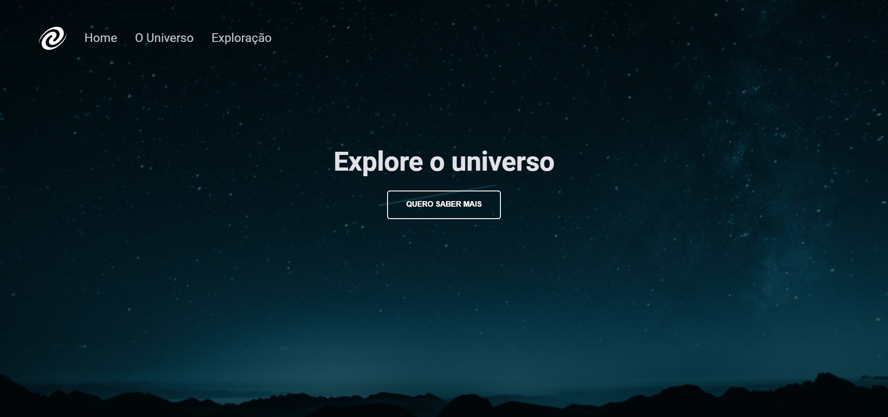

<h1 align="center"> SPA | Universe </h1>

This project was developed in Stage 06 of Explorer, the first challenge was to create a SPA with routes in JavaScript!

  

 

# 🔨 Project features

`Feature 1`: Click on the button, and you will be redirected to The Universe.

`Feature 2`: Navigate between pages.

`Feature 3`: Navigate with the browser arrows.
feito compor
 

# 🚀 Technologies

The following tools were used in building the project:

- HTML
- CSS
- JavaScript

 

# 💻 you can access [here](https://)

 made with ❤ by <a href="https://www.linkedin.com/in/arks-lacerda/" target="_blank">@arks-lacerda</a>

